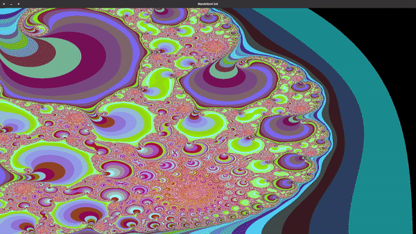

## Mandlebrot_CUDA (2021 - )
Mandlebrot_CUDA is a simple to use library that provides parallelized methods (GPU or CPU) for generating Julia set fractals.

## The Julia Set

Julia set fractals are normally generated by initializing a complex number,  $z_0 = x + yi$,  where  $i \cdot i = -1$  and x and y are image pixel coordinates in the range $[-2, 2]$. 
Variable z is repeatedly updated using:  $z = z^2 + c$, where c is another complex number that gives a specific Julia set. We note that $z = z^2 + c$ is just one method for updating z at each iteration. One can use other updating rules, e.g. $z = z^3 + c$.

After numerous iterations, for each pixel in the grid $(x, y)$, if $|z| < 2$ we say that this pixel is in the Julia set and we color it accordingly. 

Performing this calculation for a whole grid of pixels gives a fractal image.

## Demo Animation

## Creator
Yannis Marios Papagiannakos
